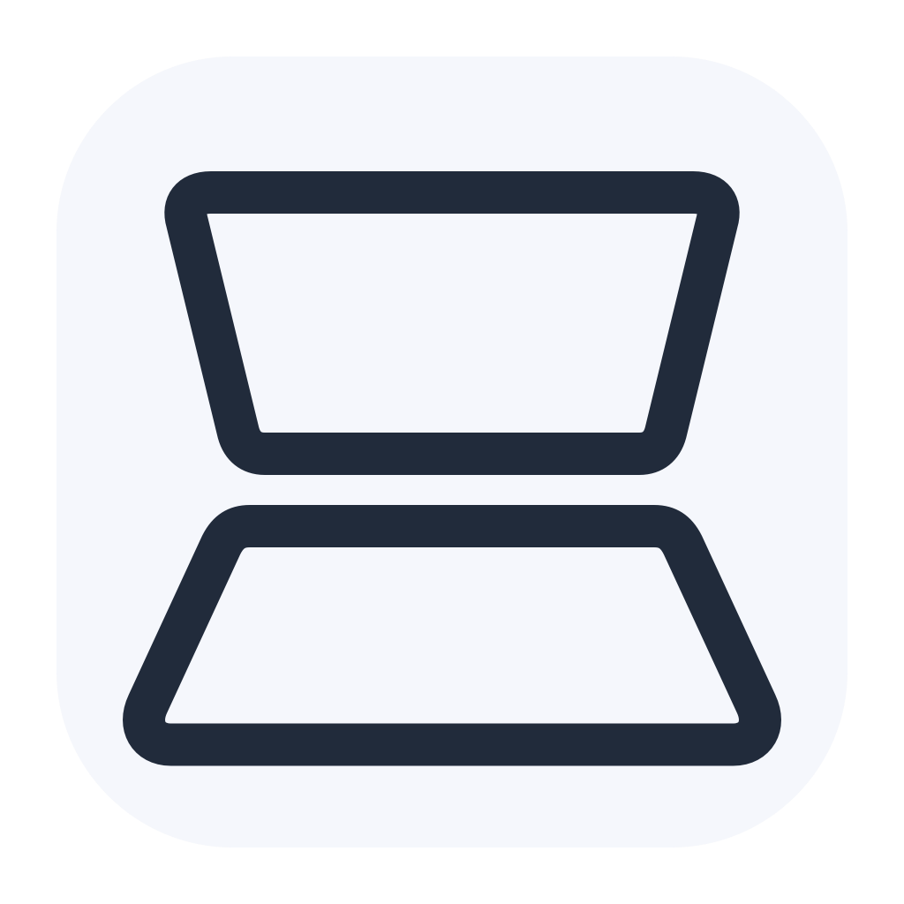

<p align="center">
  
</p>

<h1 align="center">MacDuo</h1>

<p align="center">
  
  
  
  
  
</p>

<p align="center">
  Fold your desktop with your MacBook display.
</p>

<p align="center">
  <strong>English</strong> | <a href="README.zh-CN.md">简体中文</a>
</p>

---

MacDuo is a macOS prototype that turns your live desktop into a virtual display that tilts as you open or close your MacBook. On compatible hardware, the lid angle drives the effect. Manual and Touch Bar controls let you try it without a readable sensor. The display holds its pose when you stop moving, while desktop content keeps updating.

## Features

- **Live desktop effect** — the desktop is projected through a pane rotating around the bottom hinge, with distance-based defocus and dimming.
- **Flexible controls** — use a compatible lid sensor, the panel slider, or native Touch Bar controls.
- **Quick exit** — click the folded image, stop from the menu bar, or press **Control + Option + Command + F (⌃⌥⌘F)**. Manual previews end after 60 seconds.
- **Two interface languages** — English and Simplified Chinese, with a saved language preference.
- **Local processing** — no audio capture, saved frames, or desktop uploads.

## Language

This README opens in English by default. Use the links above for Simplified Chinese.

The app also defaults to English. Choose **English** or **简体中文** under **Language / 语言** in the control panel, then quit and reopen MacDuo to apply it. The preference persists across launches. macOS permission dialogs follow the system language settings.

## Build and run

Requires **macOS 14+** and **Xcode Command Line Tools** for development builds. No third-party package dependencies. The default app build is universal for Apple Silicon and Intel; sensor support depends on the specific hardware.

```sh
./scripts/build-app.sh
open dist/MacDuo.app
```

You can also open `Package.swift` in Xcode. For screen recording, run the packaged `.app` from a stable path because permissions are tied to app identity. Set a fixed signing identity through `.local-signing-identity` or `CODE_SIGN_IDENTITY`; without one, the script creates an ad hoc signed development build. See [release setup](docs/RELEASING.md) (Chinese) for signing, notarization, and GitHub Actions configuration.

1. Check sensor status in the panel. If no sensor is available, use **Manual / Touch Bar**.
2. Position the display comfortably and choose **Calibrate Current Angle**. The initial reference is 90°.
3. Click **Start Desktop Effect** and grant screen recording access when macOS prompts. MacDuo captures the built-in display, falling back to the main display if needed.
4. Slowly open or close the display. A smaller **Angle Travel** makes the effect more sensitive. Stay within the hinge's normal range.
5. Click the folded image or press **⌃⌥⌘F** to exit. Closing the panel leaves the menu bar app running.

The fullscreen effect will not start if the emergency shortcut cannot be registered.

## Desktop effect

The desktop is viewed through a virtual glass pane rotating around the bottom hinge. Lower angles taper and defocus the upper region; returning to the reference restores the desktop, and higher angles reverse the perspective. The pose stays fixed when the angle stops. At the reference angle, the overlay hides so you can interact normally with the desktop.

A stationary eye projects each point of the rotating pane onto the desktop plane. The hinge remains anchored in both directions; the upper content moves naturally with perspective rather than keeping an artificially fixed top edge. The maximum virtual tilt is 50°. Core Image / Metal blends sharp and blurred textures at the same projected coordinates, with diffusion and dimming increasing with distance from the desktop. The silhouette fades softly to black. Blur distances scale with image height for consistent optics across resolutions. Rendering runs off the main thread, at up to 1920 pixels wide, with one frame in flight and only the latest input pending. Returning to the reference immediately restores the original image.

## Touch Bar

MacDuo selects the lid sensor at startup only when it reads a valid angle. Otherwise, it selects **Manual / Touch Bar**.

| Control | Behavior |
| --- | --- |
| Start / Stop | Toggle the live desktop effect; first use requires screen recording access. |
| Angle slider | Adjust from 10° to 160°; stays in sync with the panel and holds its value when released. |
| Reset | Return to the calibrated reference without changing calibration. |
| Dismiss | Stop the effect and restore the system Touch Bar. |

In sensor mode, the Touch Bar shows the measured angle and disables the slider and reset button. Manual desktop previews still end after 60 seconds.

On supported systems, a computer icon is registered in the Control Strip. Click it or **Show Touch Bar Controls** to expand the controls, even while the panel is closed or another app is active. Launching or waking only registers the entry; it does not automatically expand the controls. Expanded controls dismiss after 60 seconds. **Restore System Touch Bar** and **⌃⌥⌘F** also dismiss them and stop the effect. Quitting unregisters the entry.

The persistent entry uses private Control Strip interfaces loaded at runtime through DFRFoundation and system Touch Bar methods. macOS updates may break it. Hidden Control Strips, function-key mode, and the lock screen can hide the entry; enable Control Strip display in system settings. If unavailable, use the panel or menu bar. No system files are modified and no additional Input Monitoring permission is requested for this entry.

## Compatibility and limitations

- Hardware input uses the Apple HID orientation collection (usage page `0x20`, usage `0x8A`), feature report 1. This is not a publicly guaranteed lid-angle API. Lid-open status is not continuous angle data.
- A sensor is marked available only after a valid angle is read, never inferred from a chip name or device PID. Without a valid reading, manual mode remains available; detection can be retried without requesting administrator privileges or disabling SIP.
- **Mac14,7 (13-inch M2 MacBook Pro)** does not support continuous lid-angle input in MacDuo. It supports manual and Touch Bar control. Known unsupported models skip HID access. Other models match the angle interface before opening devices. Detection details show model and collection counts, without device serial numbers.
- The effect is a visual overlay. It does not modify WindowServer or app windows, and does not map clicks to transformed controls. Clicking the folded image exits. The real pointer remains in place; captured frames exclude a second cursor.
- Overlays span Spaces for ordinary desktops and fullscreen apps. Lock screens, protected video, and higher-level system windows may not be covered. The control panel and menu bar stay above the effect.
- Sleep, session changes, display configuration changes, repeated sensor failures, and capture errors stop the effect. Start it again after waking. MacDuo does not take over the login or lock screen.
- Capture currently handles one display at up to 2560 pixels wide and 30 fps. ScreenCaptureKit excludes MacDuo itself to avoid recursive capture. Multiple displays, HDR, and high refresh rates are not optimized.

## Permissions and releases

Version **0.0.2** uses the fixed bundle identifier `dev.macduo.app`. The release workflow supports Developer ID Application signing and notarization for distribution through GitHub. It is not an App Store distribution workflow; actual notarization success depends on the release CI result. Full setup: [RELEASING.md](docs/RELEASING.md) (Chinese).

Screen recording is requested only when you explicitly start the effect, without automatic retries. ScreenCaptureKit supplies the actual authorization result. Ad hoc signed builds may require renewed permission after rebuilding; a fixed certificate helps preserve identity.

If permission is enabled but capture is denied, open **App & Permission Details** to verify the running app path. Quit MacDuo, remove the old entry from macOS screen recording settings, add and authorize the app at that path, then reopen it. Avoid running the Xcode executable, a `dist` bundle, and an installed copy at the same time.

## Verification

```sh
swift test
.build/debug/MacDuo --diagnose
```

Tests cover bidirectional angle mapping, holding and reversing movement, malformed sensor reports, and language selection. `--diagnose` checks hardware without launching the UI or requesting screen recording.

Manual checks:

- Drag the manual angle from 90° to 60°, pause, then move to 120°. Both directions should tilt correctly, with stable poses and upright text.
- Start capture with a video or changing window visible. Confirm live updates without recursive images.
- Exit via a click and the emergency shortcut; check recovery after display changes and sleep.
- On compatible hardware, calibrate in sensor mode, move the lid slowly, and pause to check synchronization.
- Select each interface language, quit and reopen, then check the panel, menus, diagnostics, and Touch Bar labels.

Automated builds and tests do not replace hardware checks or visual acceptance after granting screen recording permission.

## Logo assets

The logo depicts a folded display and perspective base with a dark outline. `assets/MacDuo.svg` is the transparent vector asset, `assets/MacDuo.png` is the 1024 px preview, and `assets/MacDuo.icns` is the packaged app icon. The menu bar and Touch Bar use an adaptive monochrome version of the same geometry.

After editing `Sources/MacDuo/BrandIcon.swift`, run `./scripts/generate-icon.sh`, then `./scripts/build-app.sh`. Asset generation uses system AppKit, Swift, and Python 3.

## Acknowledgments

The hardware protocol implementation independently follows public information from [LidAngleSensor](https://github.com/samhenrigold/LidAngleSensor) and [PyBookLid](https://github.com/tcsenpai/pybooklid). The persistent Touch Bar bridge was independently implemented with reference to [touchtest](https://github.com/mrmekon/touchtest) and [EnergyBar's interface declarations](https://github.com/billziss-gh/EnergyBar/blob/master/src/System/NSTouchBar%2BSystemModal.m).
